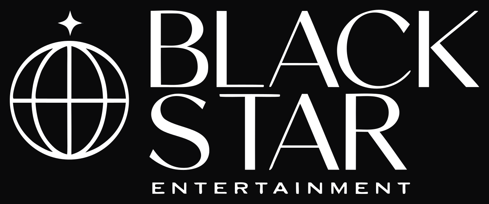

<p align="center">
  <a href="https://aetherai3.github.io/Blackstar/">
    
  </a>
</p>

<p align="center"><strong>Where Talent Meets Empire</strong><br>Independent creative & digital agency.</p>

<p align="center">
  <a href="https://aetherai3.github.io/Blackstar/"></a>
  <a href="https://github.com/AetherAI3/Blackstar/actions/workflows/pages.yml"></a>
</p>

---

## Your next move. Made real.

Black Star brings creative production and software engineering together. We work directly with founders, creators, and businesses on websites, brands, cinematic content, and AI automation — from a focused freelance project to support for a broader launch.

### What we do

| Creative | Digital |
| --- | --- |
| Brand identity & design | Websites & web apps |
| Photography & video | AI agents & automation |
| Social content & management | Marketing & launch support |

### The people behind the work

| Founder | Focus | Find us |
| --- | --- | --- |
| **Edwin D.** · Co-Founder & Creative Director | Photography, video, brand direction | [@5.0win](https://instagram.com/5.0win) · [East Coast Chromes](https://eastcoastchromes.com) |
| **Brandon B.** · Co-Founder & Lead Engineer | Full-stack software, AI agents, connected systems | [@zo.trades2](https://instagram.com/zo.trades2) · [Aether AI](https://aethersystems.net) |

### Explore our work & ventures

[**Aether AI ↗**](https://aethersystems.net) — AI tools, developer infrastructure, and software.  
[**East Coast Chromes ↗**](https://eastcoastchromes.com) — Automotive photography and cinematic media.  
[**Food Trackers ↗**](https://foodtrackers.org) — Meal planning, macros, and calorie tracking.

---

### Website

A static site with the supplied Black Star logo, a responsive layout, six service cards that stack as you scroll on desktop, project previews, portfolio filters, founder links, and an email-draft inquiry flow. Reduced-motion preferences and keyboard navigation are supported.

**[Read the agency & website specification](docs/BLACK-STAR-AGENCY-SPEC.md)** · [Verification record](docs/VERIFICATION.md) · [Asset provenance](assets/README.md)

Run locally:

```bash
git clone https://github.com/AetherAI3/Blackstar.git
cd Blackstar
python3 -m http.server 8080
```

Open `http://localhost:8080`. No build step or package installation is required.

| Path | Purpose |
| --- | --- |
| `index.html` | Page content and navigation |
| `styles.css` | Responsive design and scroll presentation |
| `script.js` | Menu, filters, inquiry preparation, starfield |
| `assets/` | Supplied logo and optimized project images |
| `docs/` | Agency specification and verification notes |
| `.github/workflows/pages.yml` | Deploy the static site to GitHub Pages |

### Deployment and contact

Pushes to `main` run the existing Pages workflow and publish the site files and assets. Keep GitHub Pages enabled for this repository. Site: **https://aetherai3.github.io/Blackstar/**.

The inquiry form opens the visitor’s email app; it does not send or store messages. The supplied recipient is `hello@blackstarentertainment.com`. Confirm that mailbox is monitored before relying on email inquiries; both founders’ Instagram links remain available.

### Guided project inquiries

A small automated service guide helps visitors explore the six services and carries their selection into the contact form. It runs locally without an AI service or chat storage. The form includes timing, message-length feedback, and a copy-brief fallback. Brandon’s team card uses his supplied portrait.

[Contact flow and Resend integration specification](docs/CONTACT-AND-RESEND-SPEC.md) covers the proposed server endpoint, request validation, spam controls, provider setup, retry behavior, and release checks. **Resend is not connected yet**; the current form still prepares an email draft.
