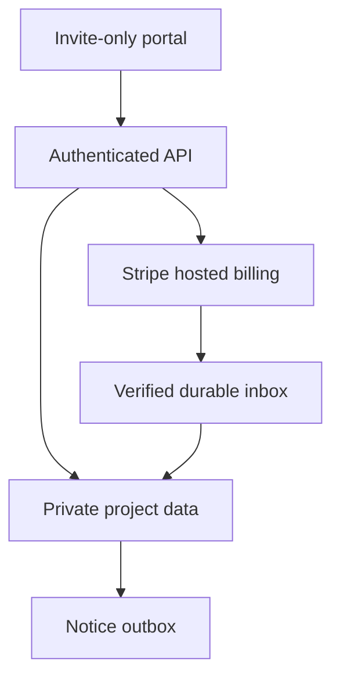

# Proposed Black Star backend

An offline, dependency-free reference for the next build. It turns the [portal plan](../docs/business/PORTAL-AND-INTEGRATIONS.md) and [billing catalog](../billing/catalog.json) into reviewable domain rules. **No backend is deployed. No payment, email, login, upload, or database adapter is connected.** The public GitHub Pages site continues to use its existing email-draft contact flow.

Brandon owns websites, development, backend, integrations, and billing. Edwin owns media production, media management, and brand scaling. Build a small client portal to collect assets, review work, and see invoices; retain hosted Stripe checkout/invoices rather than building card collection.

## Start here

```bash
cd backend
node --test
node --test --experimental-test-coverage
node scripts/mutation.mjs
```

Use a currently supported Node runtime with ESM and the built-in test runner. No package installation, environment secrets, or network access is needed. Tests read `../billing/catalog.json`; keep the sibling directory. These modules deliberately do not start an HTTP server.

| File | Concrete behavior |
| --- | --- |
| `src/access.mjs` | Requires active organization membership and explicit project assignment, including staff |
| `src/billing.mjs` | Creates a proposal from the server catalog, pins scope and price fingerprint, accepts an exact version, plans a fixed stage invoice |
| `src/money.mjs` | Integer-cent totals and basis-point splits with explicit rounding |
| `src/portal.mjs` | Constrained upload plans, quarantined assets, short download grants, bounded version-specific feedback |
| `src/webhooks.mjs` | Passes unchanged raw bytes to signature verification, persists before acknowledgement, processes against current provider state |
| `src/ledger.mjs` | Reconciles separate payment/refund/credit/fee facts; detects conflicting money records |
| `src/ports.mjs` | Every unimplemented provider operation rejects with `ADAPTER_NOT_CONFIGURED` |
| [API contract](docs/API-CONTRACT.md) | Proposed routes, authority, field allowlists, limits, and responses |
| [Provider contracts](docs/PROVIDER-CONTRACTS.md) | Required Stripe, database, storage, identity, and Resend behavior |
| [Verification and gaps](docs/VERIFICATION.md) | Actual tests and loop limits; production work still required |
| [Proposed SQL](schema/001_proposed.sql) | Private schema, composite tenant keys, unique event/fact constraints; unexecuted |

## The shortest path to operating

1. Agree a scope using the proposed catalog. A price card is a clear starting point; custom work receives a signed quote. First monthly payment funds one defined service period, not a refundable security deposit.
2. Send the approved stage through a manually created Stripe hosted invoice first. Keep client, project, scope version, amount, due date, and provider reference together. Never treat a URL visit as payment evidence.
3. Ship the Resend inquiry endpoint from the existing spec once its inbox/domain configuration is ready. Keep the current draft fallback until delivery is verified.
4. Add invite-only project overview, asset collection, and consolidated feedback. Introduce invoice mirrors and verified event processing after the manual operation works.
5. Add reliable persistence/provider adapters and pass the gates below before handling real client information. Move operational implementation and secrets to a private portal project; this public repository remains a reference.

## Proposed deployment boundary

Keep GitHub Pages public and static. A separate API deployment, originally proposed as a Cloudflare Worker, owns identity verification and server-only provider access. The Node modules here are an executable reference, not a Worker deployment bundle: `node:crypto` and `Buffer` require compatibility work or platform-native replacements. Supabase remains the proposed database/auth/private-file service; Stripe is payment authority; Resend sends operational notices. No accounts have been created by this work.



## Activation gates

- Verified JWT/session adapter, current memberships, project authorization, explicit staff billing permission, CSRF where cookies are used, exact CORS origins, durable request quotas.
- Database migration tested in a disposable database; reviewed RLS/grants; two-tenant tests for listing, guessing, downloading, updates, approvals, billing, and revoked access. The proposed SQL has no application policies/grants, so direct client access remains denied.
- Transactional quote/version acceptance; immutable accepted snapshots and append-only money facts enforced in persistence, not just application functions. Stage sums, single-issue uniqueness, and concurrent revision allocation need database transaction tests.
- Official Stripe SDK signature verification over raw bytes, endpoint mode/account binding, complete provider pagination, durable event inbox/locks/retries/dead letters, nightly reconciliation, and tested refund/credit exceptions. Pin the chosen SDK and API version at implementation time.
- Sandbox end-to-end invoice payment, partial refund, dispute, delayed event, duplicate retry, stale event, and interrupted-commit proof. No live charges or automated freelancer payouts until the owner configures and authorizes that operation.
- Private storage, MIME sniffing, malware scanning, quarantine, expiring downloads, quota enforcement, upload-finish validation, and real mobile/keyboard portal QA.
- Verified Resend sender/inbox and an authorized delivery test; durable outbox and retry control; logs omit private briefs, tokens, card details, and email addresses.
- Backup/restore rehearsal, role-revocation test, rollback, alert routing, spend caps, and confirmed accounting/legal/retention decisions.

Reference plans are intentionally separate from production readiness. The tests prove local domain behavior and test-double boundary behavior; they do not prove a deployed security perimeter or provider integration.
