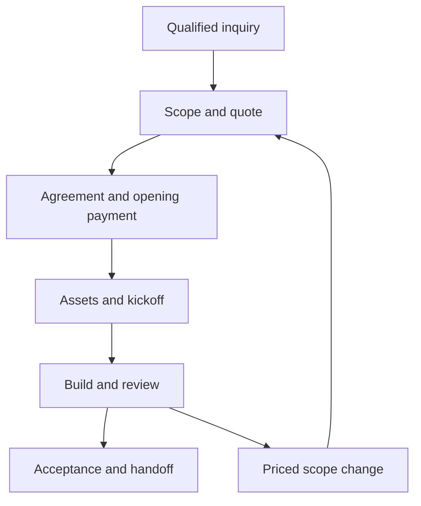

# Black Star — business and delivery foundation

**Planning baseline · updated September 12, 2026 · Proposed operating defaults, not executed agreements.**

Black Star is a two-founder creative and digital agency. Brandon is the Aether AI developer and leads rapid website/software delivery, backend systems and billing. Edwin is the media manager and leads media production, content and brand scaling. Deliver a defined result, prove it works, and give the client a usable handoff.

## Read this system

| Document | Use |
| --- | --- |
| [Business blueprint](BUSINESS-PLAN.md) | Customer focus, launch offers, acquisition and first 90 days |
| [Proposed packages and pricing](PRICING-AND-PACKAGES.md) | Scoped prices, deposits, monthly boundaries and cost assumptions |
| [Competitive evidence](PRICING-EVIDENCE.md) | Published alternatives and the limits of each comparison |
| [Team and agency economics](TEAM-AND-ECONOMICS.md) | Collaborator pay, referral terms, agency premiums and verified math |
| [Implementation roadmap](IMPLEMENTATION-ROADMAP.md) | From manual operations to tested integrations |
| [Portal and integrations](PORTAL-AND-INTEGRATIONS.md) | Development architecture, permissions, data, billing, and build gates |
| [Scope and delivery templates](SCOPE-AND-DELIVERY.md) | Turn an inquiry into a bounded project and verified handoff |
| [Visibility and visual proof](VISIBILITY-AND-PROOF.md) | Case studies, SEO, generative-engine visibility, and measurement |
| [Existing agency specification](../BLACK-STAR-AGENCY-SPEC.md) | Brand identity, services, personal links, and website behavior |
| [Contact and Resend specification](../CONTACT-AND-RESEND-SPEC.md) | Current guided inquiry and planned email delivery |

## Responsibilities and decision rights

| Area | Accountable owner | Working boundary |
| --- | --- | --- |
| Websites, apps, integrations, automation | Brandon | Architecture, estimates, implementation, tests, release, technical support |
| Backend, hosting, domains, credentials | Brandon | Environment setup, access, monitoring, recovery, account handoff |
| Billing operations | Brandon | Quotes, invoice schedule, payment reconciliation, recurring costs, records |
| Brand, photo, video, creative production | Edwin | Creative discovery, direction, production, edits, final media |
| Social and campaign creative | Edwin | Content scope, asset preparation, publishing calendar |
| SEO and launch | Brandon technical; Edwin creative | Brandon owns indexability and measurement; Edwin owns creative proof and editorial presentation |
| Mixed project commitments | Both founders | Each signs off on their capacity and deliverables before the proposal is sent |
| Client communication | One named project lead | Owns status, consolidates feedback, records approvals, escalates blockers |
| Client approval | One named client approver | Consolidates stakeholder feedback; approves scope, revisions, and release |

Billing responsibility does not establish equity ownership or authority to make every company commitment. Neither founder promises the other’s delivery dates without checking capacity. Internal implementation details stay out of the client’s dashboard unless a decision depends on them.

## Business structure decision register

These are setup decisions to record privately before relying on them in contracts or payment accounts. This document does not establish a legal entity.

| Decision | Owner | Completion evidence |
| --- | --- | --- |
| Trading name versus registered contracting entity | Both | Approved legal/payee identity used consistently on proposals and invoices |
| Founder ownership, contributions, decision rights, departure and dispute process | Both | Executed founder agreement; obtain appropriate professional review |
| Jurisdiction, registration, tax/accounting setup | Both; Brandon coordinates | Confirmed setup with relevant professionals; do not infer from travel locations |
| Bank and payment accounts, signing authority | Brandon; both approve | Business accounts and authorized access recorded privately |
| Existing IP versus client deliverables | Both | Schedule separating Aether/Edwin assets, reusable tools, licenses, and project-specific work |
| Client agreement and privacy terms | Both | Reviewed templates covering payment, scope, rights, confidentiality, cancellation, and data handling |
| Insurance and subcontractor requirements | Both | Requirements resolved for the actual services and clients |
| Agency domain and monitored inbox | Brandon | Ownership and delivery verified; no assumed domain ownership |

Do not put real contracts, client names without permission, bank details, credentials, or client project records in this public repository. Store project records in the private operational system.

## Offer structure

Sell bounded engagements rather than an unlimited list of capabilities. The existing budget dropdown is inquiry qualification, not a price list.

| Engagement | Primary output | Lead | Scoping unit |
| --- | --- | --- | --- |
| Website launch | Approved responsive site and handoff | Brandon | Named routes, templates, integrations, content responsibilities |
| Application / portal build | A tested workflow with explicit roles and data | Brandon | User stories, permissions, integrations, acceptance scenarios |
| Brand foundation | Approved identity kit and usable exports | Edwin | Concepts, selected direction, formats, revision rounds |
| Content production | A specified shoot and edited asset set | Edwin | Shoot duration/location, shot list, edits, aspect ratios, rights |
| Social / launch support | A defined content cycle or launch campaign | Edwin | Platforms, deliverable counts, posting/approval responsibilities |
| Automation implementation | A tested process connecting named systems | Brandon | Triggers, actions, exceptions, usage limits, human approvals |
| Ongoing care | Maintenance or recurring creative allocation | Relevant lead | Monthly capacity, response window, exclusions, rollover policy |

A mixed engagement combines named line items under one project lead. Each proposal explicitly separates launch work from ongoing hosting, usage, support, and future features. The [proposed catalog](../../billing/catalog.json) now supplies costed starting prices and payment schedules. Validate actual scope, third-party costs and capacity before accepting a quote; founder approval is still needed to publish or activate these proposed prices.

## Lead to delivery

1. **Qualify:** record goal, decision-maker, budget range, timing, assets, and service fit. Route creative to Edwin, technical to Brandon, and mixed work to both. No automatic delivery-date promise.
2. **Scope:** enumerate outputs, exclusions, dependencies, revision allowance, milestones, and acceptance evidence. Identify unfamiliar integrations early; use a separately agreed discovery phase where necessary.
3. **Book:** require signed scope and the agreed opening payment before reserving production time. Standard two-part proposed projects use 50% opening / 50% balance; discovery is prepaid and recurring offers cover one authorized month. The signed quote controls the actual schedule, including any approved custom milestones.
4. **Kick off:** name the approver, request assets/access, agree communication cadence, and set milestone dates after dependencies are ready.
5. **Deliver visibly:** give one concise weekly update: completed, next, waiting on you, and any scope/date impact. Share an approved preview or contact sheet rather than raw internal activity.
6. **Review:** collect one consolidated feedback list per round. Tag each item as included correction, revision, question, or scope change.
7. **Close:** obtain acceptance, reconcile agreed payments, deliver the package and access, record support dates, and request separate permission for a case study.

Suggested capacity default: one substantial technical build and one substantial creative production at a time. Treat this as an initial scheduling limit to review weekly, not a promise of fixed delivery speed.

## Commercial controls

Brandon maintains the invoice ledger and reconciles it weekly against the payment provider. Track quoted value, invoiced value, collected payments, refunds/credits, and outstanding balances separately. Do not treat a sent invoice or payment-page visit as collected revenue.

The proposal states milestone amounts, due dates, currency, third-party charges, taxes as applicable, cancellation terms, and what happens if client assets or approvals are late. Any pause, rescheduling, rights transfer, or payment consequence follows the executed agreement. Do not silently disable a delivered client site over a disputed invoice.

Recurring work needs an explicit service period and scope: hosting ownership, monitoring, backups, patching, included support capacity, incident contact, cancellation, and overages. New features are estimated separately. Record provider usage and renewal dates so infrastructure costs do not disappear into project margins.

## First implementation sequence

| Stage | Deliverable | Exit evidence |
| --- | --- | --- |
| 0 — operate now | Use scope/approval/handoff templates and a private project ledger | One sample engagement complete from inquiry through handoff with synthetic data |
| 1 — reliable intake | Verified inbox and Resend endpoint from the existing spec | Approved delivery test; honest failure and retry behavior |
| 2 — portal core | Invite-only projects, asset requests, feedback, approvals | Two-client isolation and upload/review acceptance tests pass |
| 3 — billing visibility | Provider invoices, trusted events, reconciliation | Sandbox paid/failed/refunded/duplicate-event scenarios pass |
| 4 — proof and acquisition | First authorized case study and indexable service pages | Evidence attached, publication permission recorded, crawl checks pass |
| 5 — recurring care | Support queue, renewal tracking, maintenance checklist | Restore rehearsal and a complete monthly care report |

The [backend reference skeleton](../../backend/README.md), [billing catalog/calculator](../../billing/README.md) and [review record](../reviews/2026-09-12-backend-business/README.md) now support this proposal. They do not provision the portal, activate payment/email services, establish the company or verify client outcomes. The public site, portrait, deterministic guide and email-draft flow are already present.
