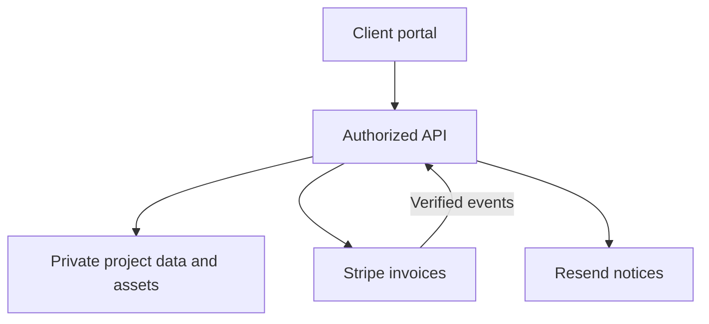

# Client portal and development integrations

Status: proposed implementation contract. Brandon owns development, backend, release, and billing. Keep the current public site independent of the private portal so a portal incident does not remove the agency’s contact page.

The September 12 [backend reference skeleton](../../backend/README.md) makes selected domain rules executable offline. [Billing](../../billing/README.md) supplies proposed packages and exact schedules; [the roadmap](IMPLEMENTATION-ROADMAP.md) lists remaining adapter, database and release work. None is a deployed portal or payment integration.

## Product boundary

The portal answers four client questions: What is happening? What do you need from me? What am I reviewing? What is due? It centralizes asset collection, versioned feedback, approvals, and invoice visibility. Initial release excludes live chat, AI agents, a full CRM, custom card processing, and elaborate project-management features.

| Client view | Essential content | Main action |
| --- | --- | --- |
| Overview | Project stage, next milestone, owner, latest update | Complete the next requested action |
| Assets | Requested files, instructions, due date, upload status | Upload an asset |
| Review | Named deliverable version, preview, consolidated feedback, rounds remaining | Request changes or approve this version |
| Billing | Invoice number, amount/currency, provider status, due date | Open provider-hosted invoice |
| Handoff | Final files, ownership/access checklist, support dates | Download and acknowledge receipt |

Visual direction: near-black surfaces, restrained gold accents, rounded controls, readable gray body text. Use a simple vertical navigation and one prominent next-action card. Status needs text and an icon, not color alone. On mobile, stack the same cards; do not hide invoices or approvals behind hover. Use real deliverable previews and an empty state explaining what comes next. Show internal notes only to staff.

## Proposed stack and separation

| Layer | Proposed choice | Responsibility |
| --- | --- | --- |
| Public marketing site | Existing GitHub Pages site | Services, proof, inquiry, portal sign-in link once live |
| Portal frontend | Separate deployment on an approved domain | Authenticated interface; never public client records |
| API | Cloudflare Worker | Authorization, validation, integrations, signed URLs, webhook processing |
| Identity / data / files | Supabase Auth, Postgres, private Storage | Invite-based identity, tenant records, private assets |
| Payments | Stripe hosted invoices | Invoice/payment experience; no card details stored by Black Star |
| Notifications | Resend | Invitations and project notices after provider/domain configuration |
| Source and releases | Private portal repository + GitHub Actions | Review, tests, staging, production, rollback |

These provider choices are recommendations for this build, not existing subscriptions or provisioned accounts. Keep one primary database/storage platform initially. An Aether integration can be added later against a defined API; the client portal must not depend on speculative Aether features.

## Identity and permissions

Create client organizations by invitation; never accept a self-selected organization ID as proof of membership. Roles: staff admin, project lead, client approver, client contributor. Assign staff to projects explicitly; log privileged administrative access. Contributors can upload and comment; only the designated approver can approve a scope or deliverable. Only authorized staff can issue invoices or change milestones.

Enforce membership on every API request and database access. Enable row-level security for exposed tables; service credentials remain server-side and must not substitute for request authorization. Supabase distinguishes client access governed by RLS from elevated service access that can bypass it. [Supabase RLS documentation](https://supabase.com/docs/guides/database/postgres/row-level-security).

Use private buckets and short-lived signed download URLs after access checks. Validate upload size/type on the server, quarantine uploads until approved scanning completes, and serve untrusted formats as downloads. MVP limit proposal: 100 MB per upload for documents, images, and small previews; large raw footage uses an approved private transfer link until resumable upload is implemented. Do not ask clients to upload passwords. Use provider invitations or a dedicated secret-sharing system for access.

## Minimal data contract

Every project-scoped record carries project and organization references with foreign-key consistency. Enforce the relationship in the database/API; filtering by organization only in the UI is insufficient.

| Record | Key information |
| --- | --- |
| Organization and membership | Organization ID, user ID, role, invitation/active/revoked status |
| Project | Client organization, assigned lead, stage, approver, dates |
| Scope version | Immutable accepted scope, acceptance criteria, revision allowance, signed reference |
| Milestone | Deliverables, dependency, due date, status, invoice reference |
| Asset request and asset | Requested item, owner, object key, version/hash, validation status |
| Deliverable version | Version ID, preview/final objects, author, review state |
| Feedback round | Version, consolidated comments, submitted timestamp, disposition |
| Approval | Approver identity, exact version/hash, decision, timestamp |
| Change request | Reason, additions/removals, price/date impact, approval state |
| Invoice mirror | Provider invoice/customer IDs, amount in minor units, currency, due date, status, last sync |
| Event inbox and audit log | Unique provider event ID, processing state, actor, action, target, timestamp |

Approved versions remain immutable. A new upload creates a new version; it cannot inherit an old approval. Concurrent approval must compare the expected version. Deleted/revoked users lose access immediately; existing signed asset URLs expire within the configured short TTL.

## API surface

| Operation | Authority and rule |
| --- | --- |
| `POST /invitations` | Staff only; fixed organization, expiry, single-use acceptance |
| `GET /projects` | Return only accessible projects |
| `POST /projects/:id/uploads` | Authorized contributor; issue constrained upload target |
| `POST /projects/:id/feedback-rounds` | Approver submits consolidated review against a version |
| `POST /projects/:id/approvals` | Approver; exact version, authenticated explicit action |
| `POST /projects/:id/change-requests` | Client or staff can propose; staff prices, approver accepts |
| `GET /projects/:id/invoices` | Authorized membership; organization-bound invoice links |
| `POST /webhooks/stripe` | Provider signature verification; no browser session dependency |

Use server validation, rate limits, bounded pagination, safe error responses, and correlation IDs. If using cookie sessions, include CSRF protection and restrictive cookie settings. CORS is not authorization. Audit decisions and state changes without logging brief contents or tokens. Private pages require authentication and noindex; robots directives do not secure data.

## Billing and notifications

Stripe remains the payment source of truth; the portal is a read model. Create invoices server-side from approved scope/milestones with fixed customer mappings. Never let a browser set the payable amount, organization, or paid status. Validate webhook signatures against the raw request body, deduplicate event IDs, and tolerate retries and out-of-order events. Stripe documents these delivery behaviors. [Stripe webhook documentation](https://docs.stripe.com/webhooks).

Persist a valid event to a durable inbox before acknowledging it. Process asynchronously, fetch current provider state when ordering is uncertain, and reconcile scheduled invoice snapshots against the provider. Distinguish draft/open/paid/void/uncollectible and display refunds/credits without pretending the original invoice vanished. A browser success redirect never releases work automatically. Keep test/live credentials, customers, and events separate.

Send notices through an outbox after the business transaction commits: invitation, assets requested, review ready, feedback received, milestone approved, invoice available, and handoff ready. Use idempotency per event/recipient/template and bounded retries with failed-job visibility. Email links point to authenticated portal views; exclude sensitive files and unnecessary brief content. Choose one invoice-reminder sender to prevent duplicate Stripe and Resend reminders. The public inquiry endpoint remains governed by the existing [Resend spec](../CONTACT-AND-RESEND-SPEC.md).

## Release and operational gates

1. Separate development, staging, and production data/secrets. Use synthetic clients in tests and previews.
2. CI checks tenant boundaries, roles, validation, migrations, webhook verification, idempotency, and upload/download authorization. No production sends in CI.
3. Test client A cannot list, guess, update, download, or approve client B’s objects; repeat with revoked membership and a changed organization ID.
4. Test duplicate/out-of-order/forged payment events, uncertain payment state, notification retry, stale approval version, expired links, and rejected uploads.
5. Browser-check desktop and mobile upload, review, keyboard navigation, invoice handoff, empty/loading/error states, and access revocation.
6. Require database backup and restore rehearsal, documented rollback, error alerts, spend thresholds, and a named incident contact before real client data.
7. Reconcile one sandbox project through invoice and handoff. Production activation requires configured accounts and a controlled authorized live check.

Proposed retention baseline for approval: signed asset URLs expire after five minutes; operational logs after 30 days; temporary upload quarantine after seven days; project assets reviewed for export/removal 90 days after closure. Accounting and executed agreements follow the company’s confirmed retention requirements. Document backup expiry and provider copies before promising permanent deletion. These settings need implementation and owner confirmation.
